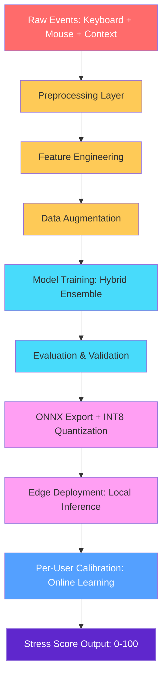
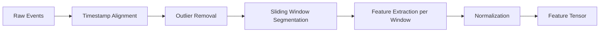
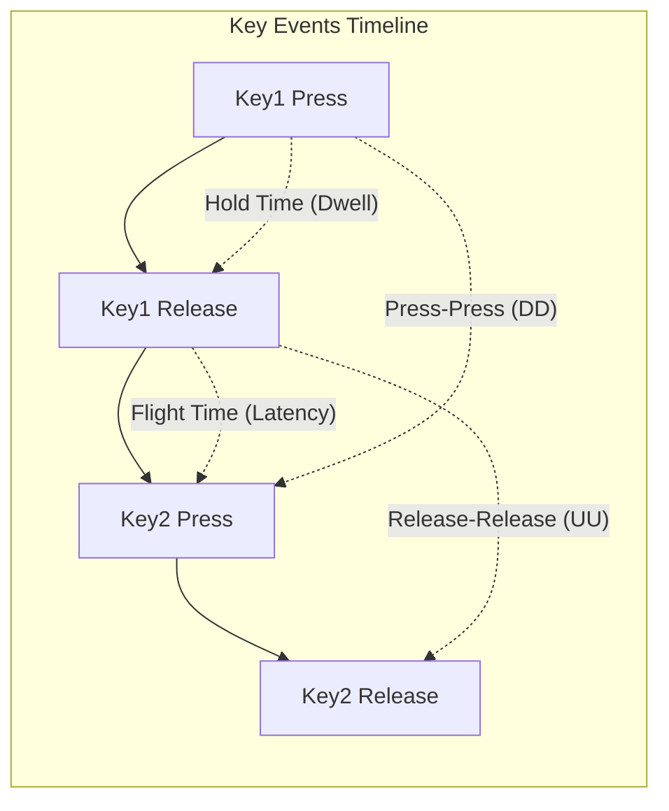
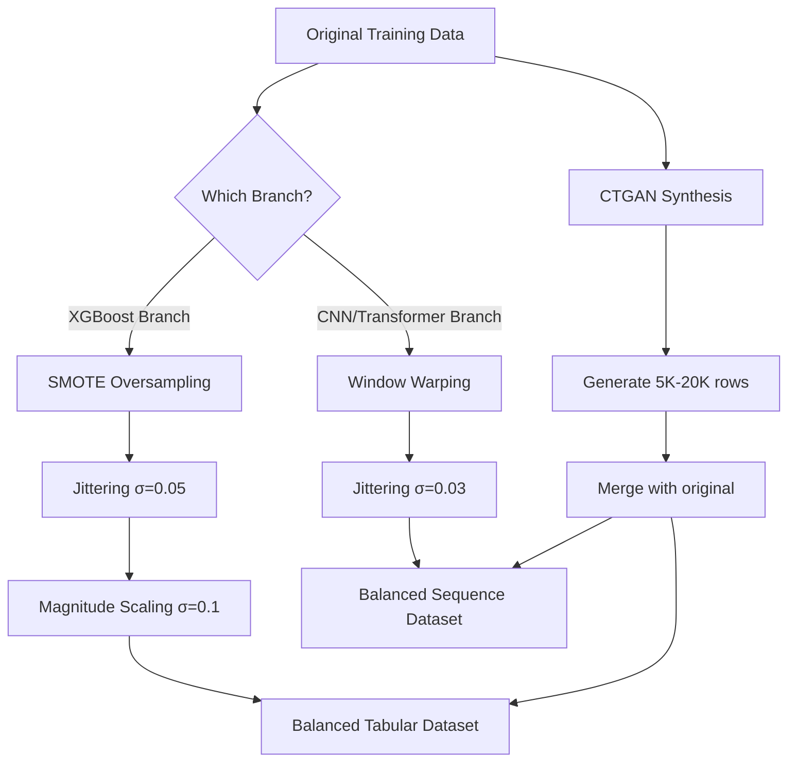

# 🧠 MindPulse ML Pipeline — Part 1: Data Collection, Preprocessing, Feature Engineering & Augmentation

> This document covers everything from raw event capture to model-ready feature tensors. Part 2 covers model architecture, training, evaluation, and deployment.

---

## 1. Pipeline Overview (End-to-End)



> [!NOTE]
> **Part 1 scope** (this document): Steps A → D (highlighted in yellow above).
> **Part 2 scope**: Steps E → J (model architecture through deployment).

---

## 2. Data Collection & Raw Events

### 2.1 What We Capture (Privacy-First)

The fundamental constraint of MindPulse is that we **never record what the user types or sees** — only *how* they interact with their machine. This is the core privacy guarantee.

| Source | Raw Event | What We Record | What We DON'T Record |
|---|---|---|---|
| Keyboard | Key press/release | `timestamp_press`, `timestamp_release`, `key_category` (letter/digit/special/modifier) | Actual key character |
| Mouse | Move/Click/Scroll | `x, y, timestamp`, `click_type`, `scroll_delta` | Screen content, URLs |
| Context | Tab/App switch | `switch_timestamp`, `app_category_hash` | App name, tab content |

### 2.2 Event Schema (Python Dataclass)

```python
from dataclasses import dataclass
from typing import Optional

@dataclass
class KeyEvent:
    timestamp_press: float    # Unix timestamp (ms precision)
    timestamp_release: float
    key_category: str         # 'alpha', 'digit', 'special', 'modifier', 'backspace'

@dataclass
class MouseEvent:
    timestamp: float
    x: int
    y: int
    event_type: str           # 'move', 'click', 'scroll'
    click_type: Optional[str] # 'left', 'right', 'middle'
    scroll_delta: Optional[int]

@dataclass
class ContextEvent:
    timestamp: float
    event_type: str           # 'tab_switch', 'app_switch'
    category_hash: str        # SHA-256 of app/domain category (not the name)
```

### 2.3 Data Capture Implementation

```python
from pynput import keyboard, mouse
from collections import deque
import time
import hashlib

class BehavioralCollector:
    """Captures keyboard + mouse events with privacy-first design."""
    
    def __init__(self, buffer_size=10000):
        self.key_buffer = deque(maxlen=buffer_size)
        self.mouse_buffer = deque(maxlen=buffer_size)
        self.context_buffer = deque(maxlen=buffer_size)
        self._pending_presses = {}  # Track key press times
    
    def _categorize_key(self, key) -> str:
        """Convert key to category without storing the actual character."""
        key_str = str(key)
        if key == keyboard.Key.backspace:
            return 'backspace'
        elif hasattr(key, 'char') and key.char:
            if key.char.isalpha():
                return 'alpha'
            elif key.char.isdigit():
                return 'digit'
            return 'special'
        return 'modifier'
    
    def on_key_press(self, key):
        category = self._categorize_key(key)
        self._pending_presses[category] = time.time() * 1000  # ms
    
    def on_key_release(self, key):
        category = self._categorize_key(key)
        if category in self._pending_presses:
            self.key_buffer.append(KeyEvent(
                timestamp_press=self._pending_presses.pop(category),
                timestamp_release=time.time() * 1000,
                key_category=category
            ))
    
    def on_mouse_move(self, x, y):
        self.mouse_buffer.append(MouseEvent(
            timestamp=time.time() * 1000, x=x, y=y,
            event_type='move', click_type=None, scroll_delta=None
        ))
    
    def on_mouse_click(self, x, y, button, pressed):
        if pressed:
            self.mouse_buffer.append(MouseEvent(
                timestamp=time.time() * 1000, x=x, y=y,
                event_type='click', click_type=str(button), scroll_delta=None
            ))
    
    def start(self):
        self.kb_listener = keyboard.Listener(
            on_press=self.on_key_press, on_release=self.on_key_release
        )
        self.mouse_listener = mouse.Listener(
            on_move=self.on_mouse_move, on_click=self.on_mouse_click
        )
        self.kb_listener.start()
        self.mouse_listener.start()
```

### 2.4 Context Switching Detection (Windows)

```python
import ctypes
import psutil

def get_active_window_category() -> str:
    """Get a privacy-safe category hash of the active window."""
    hwnd = ctypes.windll.user32.GetForegroundWindow()
    pid = ctypes.c_ulong()
    ctypes.windll.user32.GetWindowThreadProcessId(hwnd, ctypes.byref(pid))
    try:
        proc = psutil.Process(pid.value)
        # Hash the process name — we never store the actual name
        return hashlib.sha256(proc.name().encode()).hexdigest()[:16]
    except (psutil.NoSuchProcess, psutil.AccessDenied):
        return 'unknown'
```

---

## 3. Preprocessing Layer

### 3.1 Pipeline Steps



### 3.2 Timestamp Alignment

All events use **Unix timestamps in milliseconds**. When collecting from multiple sources (desktop app + Chrome extension), we need alignment:

- Align keyboard, mouse, and context events to a **common clock**
- Handle clock drift between Chrome extension and desktop app via NTP sync
- Sort all events chronologically into a single unified timeline

```python
def align_events(key_events, mouse_events, context_events):
    """Merge all events into a single sorted timeline."""
    all_events = []
    for e in key_events:
        all_events.append(('key', e.timestamp_press, e))
    for e in mouse_events:
        all_events.append(('mouse', e.timestamp, e))
    for e in context_events:
        all_events.append(('context', e.timestamp, e))
    
    all_events.sort(key=lambda x: x[1])  # Sort by timestamp
    return all_events
```

### 3.3 Outlier Removal

Physiologically impossible or artifactual values must be removed before feature extraction:

```python
import numpy as np

def remove_outliers(values: np.ndarray, method='iqr') -> np.ndarray:
    """Remove physiologically impossible values."""
    if method == 'iqr':
        Q1, Q3 = np.percentile(values, [25, 75])
        IQR = Q3 - Q1
        lower, upper = Q1 - 3.0 * IQR, Q3 + 3.0 * IQR  # 3x IQR (wide)
        return values[(values >= lower) & (values <= upper)]
    elif method == 'threshold':
        # Hold times > 2s or < 10ms are artifacts
        return values[(values >= 10) & (values <= 2000)]
```

**What to remove and why:**

| Artifact | Threshold | Reason |
|---|---|---|
| Hold time < 10ms | Remove | Key bounce (hardware artifact) |
| Hold time > 2000ms | Remove | User walked away mid-press |
| Flight time < 0ms | Remove | Physically impossible |
| Flight time > 5000ms | Remove | Pause, not typing (separate signal) |
| Mouse speed > 10,000 px/s | Remove | Sensor/driver glitch |
| Duplicate events | Remove | Same timestamp + same category |

### 3.4 Sliding Window Segmentation

We segment the continuous event stream into overlapping windows for feature extraction:

```
┌─────────────────────────────────────────────────────┐
│ Window Size: 300 seconds (5 minutes)                │
│ Step Size:    60 seconds (1 minute overlap → 80%)   │
│ Min Events:   50 keystrokes per window              │
│               (skip sparse windows)                 │
└─────────────────────────────────────────────────────┘
```

```python
def create_sliding_windows(events, window_sec=300, step_sec=60, min_keys=50):
    """Create overlapping windows from the event stream."""
    windows = []
    start = events[0].timestamp
    end = events[-1].timestamp
    t = start
    
    while t + window_sec <= end:
        window_events = [e for e in events if t <= e.timestamp < t + window_sec]
        key_events = [e for e in window_events if isinstance(e, KeyEvent)]
        
        if len(key_events) >= min_keys:
            windows.append({
                'start_time': t,
                'end_time': t + window_sec,
                'key_events': key_events,
                'mouse_events': [e for e in window_events if isinstance(e, MouseEvent)],
                'context_events': [e for e in window_events if isinstance(e, ContextEvent)],
            })
        t += step_sec
    
    return windows
```

> [!IMPORTANT]
> **Why 5-minute windows?** ETH Zurich research shows that stress patterns stabilize within 3-5 minutes. Shorter windows are too noisy; longer windows miss acute stress spikes. The 1-minute step gives us 80% overlap, creating smooth temporal transitions.

**Window count estimation:**
- For a 1-hour typing session: `(3600 - 300) / 60 + 1` = **56 windows**
- For a full 8-hour workday with 50% active typing: **~224 windows per user per day**

### 3.5 Normalization

Two-stage normalization is critical because stress signals are *relative*, not absolute:

| Stage | Method | Purpose |
|---|---|---|
| **Global** | Z-score: `(x - μ_global) / σ_global` using training set stats | Align feature scales across all users for model training |
| **Per-User** | Z-score: `(x - μ_user_hour) / σ_user_hour` using user's own baseline at that hour | Detect deviation from *personal* norm (circadian-adjusted) |

> [!TIP]
> The dual normalization is a key novelty. Most papers only do global normalization. By also computing per-user z-scores *partitioned by hour of day*, we get circadian-adjusted baselines. A user who types at 60 WPM at 3 PM (normally 80 WPM at that hour) gets a much stronger stress signal than a different user who naturally types at 60 WPM.

```python
class DualNormalizer:
    """Two-stage normalization: global + per-user circadian."""
    
    def __init__(self, global_stats: dict, user_stats: dict = None):
        self.global_mean = global_stats['mean']  # np.ndarray, shape [n_features]
        self.global_std = global_stats['std']     # np.ndarray, shape [n_features]
        # user_stats: Dict[hour_of_day -> {'mean': ndarray, 'std': ndarray}]
        self.user_stats = user_stats
    
    def transform(self, features: np.ndarray, hour_of_day: int) -> np.ndarray:
        # Stage 1: Global normalization
        z_global = (features - self.global_mean) / (self.global_std + 1e-8)
        
        # Stage 2: Per-user circadian normalization (if calibrated)
        if self.user_stats and hour_of_day in self.user_stats:
            u = self.user_stats[hour_of_day]
            z_user = (features - u['mean']) / (u['std'] + 1e-8)
            return np.concatenate([z_global, z_user])  # Stack both as input
        
        # During calibration: pad with zeros for per-user features
        return np.concatenate([z_global, np.zeros_like(z_global)])
    
    @staticmethod
    def fit_global(all_features: np.ndarray) -> dict:
        """Compute global stats from training data."""
        return {
            'mean': np.mean(all_features, axis=0),
            'std': np.std(all_features, axis=0),
        }
```

---

## 4. Feature Engineering (Per Window)

### 4.1 Keystroke Timing Features

The fundamental timing features from keystroke dynamics research:



**Raw Timing Definitions:**

| Feature | Formula | Description |
|---|---|---|
| `hold_time` | `t_release - t_press` | How long a key is held down (Dwell Time) |
| `flight_time` | `t_press[i+1] - t_release[i]` | Gap between releasing one key and pressing next (Up-Down) |
| `dd_time` | `t_press[i+1] - t_press[i]` | Press-to-Press interval (Down-Down) |
| `uu_time` | `t_release[i+1] - t_release[i]` | Release-to-Release interval (Up-Up) |

**Aggregate Statistics per Window:**

```python
import numpy as np
from scipy import stats as scipy_stats

def extract_keyboard_features(key_events: list) -> dict:
    """Extract 11 keyboard features from a window of key events."""
    
    hold_times = np.array([e.timestamp_release - e.timestamp_press for e in key_events])
    flight_times = np.array([
        key_events[i+1].timestamp_press - key_events[i].timestamp_release
        for i in range(len(key_events) - 1)
    ])
    
    # Remove outliers
    hold_times = hold_times[(hold_times >= 10) & (hold_times <= 2000)]
    flight_times = flight_times[(flight_times >= 0) & (flight_times <= 5000)]
    
    backspace_count = sum(1 for e in key_events if e.key_category == 'backspace')
    total_keys = len(key_events)
    
    # --- Pause Detection ---
    # A "pause" is a flight time > 2 seconds
    pauses = flight_times[flight_times > 2000]
    
    # --- Burst Detection ---
    # A "burst" is a continuous sequence of keystrokes without pauses
    bursts = []
    current_burst = 0
    for ft in flight_times:
        if ft > 2000:
            if current_burst > 0:
                bursts.append(current_burst)
            current_burst = 0
        else:
            current_burst += 1
    if current_burst > 0:
        bursts.append(current_burst)
    
    # --- Shannon Entropy of Inter-Key Intervals ---
    # Low entropy = rhythmic typing (relaxed)
    # High entropy = chaotic timing (stressed)
    if len(flight_times) > 10:
        hist, _ = np.histogram(flight_times, bins=20, density=True)
        hist = hist[hist > 0]
        entropy = -np.sum(hist * np.log2(hist + 1e-10))
    else:
        entropy = 0.0
    
    # --- WPM Calculation ---
    total_time_ms = sum(hold_times) + sum(flight_times) if len(flight_times) > 0 else 1
    wpm = (total_keys / 5) / (total_time_ms / 60000) if total_time_ms > 0 else 0
    
    return {
        'hold_time_mean': np.mean(hold_times) if len(hold_times) > 0 else 0,
        'hold_time_std': np.std(hold_times) if len(hold_times) > 0 else 0,
        'hold_time_median': np.median(hold_times) if len(hold_times) > 0 else 0,
        'flight_time_mean': np.mean(flight_times) if len(flight_times) > 0 else 0,
        'flight_time_std': np.std(flight_times) if len(flight_times) > 0 else 0,
        'typing_speed_wpm': wpm,
        'error_rate': backspace_count / max(total_keys, 1),
        'pause_frequency': len(pauses) / max((sum(flight_times) / 60000), 0.1),
        'pause_duration_mean': np.mean(pauses) if len(pauses) > 0 else 0,
        'burst_length_mean': np.mean(bursts) if len(bursts) > 0 else total_keys,
        'rhythm_entropy': entropy,
    }
```

**Stress signal direction for each feature:**

| Feature | Under Stress | Explanation |
|---|---|---|
| `hold_time_mean` | ↑ Increases | Neuromotor noise → fingers press harder/longer |
| `hold_time_std` | ↑ Increases | Inconsistency increases under cognitive load |
| `flight_time_std` | ↑ Increases | "Fits and starts" pattern (ETH Zurich) |
| `typing_speed_wpm` | ↓ Decreases | Overall typing slows down |
| `error_rate` | ↑ Increases | More typos, more backspaces |
| `pause_frequency` | ↑ Increases | More *short* pauses (hesitation) |
| `pause_duration_mean` | ↓ Decreases | Many short pauses >> few long pauses |
| `burst_length_mean` | ↓ Decreases | Shorter typing bursts between pauses |
| `rhythm_entropy` | ↑ Increases | Typing rhythm becomes chaotic |

### 4.2 Mouse Features

```python
import math

def detect_rage_clicks(clicks: list, threshold_ms=2000, min_clicks=3, radius=50) -> int:
    """Detect clusters of rapid repeated clicks (frustration signal)."""
    rage_count = 0
    i = 0
    while i < len(clicks):
        cluster = [clicks[i]]
        j = i + 1
        while j < len(clicks):
            dt = clicks[j].timestamp - clicks[i].timestamp
            dx = abs(clicks[j].x - clicks[i].x)
            dy = abs(clicks[j].y - clicks[i].y)
            if dt <= threshold_ms and dx <= radius and dy <= radius:
                cluster.append(clicks[j])
                j += 1
            else:
                break
        if len(cluster) >= min_clicks:
            rage_count += 1
        i = j if j > i + 1 else i + 1
    return rage_count

def compute_scroll_variance(mouse_events: list) -> float:
    """Compute variance of scroll velocity."""
    scrolls = [e for e in mouse_events if e.event_type == 'scroll']
    if len(scrolls) < 2:
        return 0.0
    velocities = []
    for i in range(1, len(scrolls)):
        dt = (scrolls[i].timestamp - scrolls[i-1].timestamp) / 1000
        if dt > 0:
            velocities.append(abs(scrolls[i].scroll_delta or 0) / dt)
    return np.std(velocities) if velocities else 0.0

def extract_mouse_features(mouse_events: list) -> dict:
    """Extract 6 mouse features from a window of mouse events."""
    
    moves = [e for e in mouse_events if e.event_type == 'move']
    clicks = [e for e in mouse_events if e.event_type == 'click']
    
    # --- Speed & Direction Calculation ---
    speeds, directions = [], []
    for i in range(1, len(moves)):
        dx = moves[i].x - moves[i-1].x
        dy = moves[i].y - moves[i-1].y
        dt = (moves[i].timestamp - moves[i-1].timestamp) / 1000  # seconds
        if dt > 0:
            dist = math.sqrt(dx**2 + dy**2)
            speed = dist / dt
            if speed < 10000:  # Filter glitches
                speeds.append(speed)
                directions.append(math.atan2(dy, dx))
    
    # --- Direction Change Rate (cursor indecision) ---
    dir_changes = 0
    if len(directions) > 1:
        dir_changes = sum(
            1 for i in range(1, len(directions))
            if abs(directions[i] - directions[i-1]) > math.pi / 4
        )
    
    # --- Rage clicks ---
    rage_clicks = detect_rage_clicks(clicks)
    
    return {
        'mouse_speed_mean': np.mean(speeds) if speeds else 0,
        'mouse_speed_std': np.std(speeds) if speeds else 0,
        'direction_change_rate': dir_changes / max(len(directions), 1),
        'click_count': len(clicks),
        'rage_click_count': rage_clicks,
        'scroll_velocity_std': compute_scroll_variance(mouse_events),
    }
```

### 4.3 Context-Switch Features

```python
def extract_context_features(context_events: list) -> dict:
    """Extract 3 context-switching features from a window."""
    
    switches = context_events
    if len(switches) < 2:
        return {
            'tab_switch_freq': 0,
            'switch_entropy': 0,
            'session_fragmentation': 0,
        }
    
    # --- Frequency (switches per minute) ---
    duration_min = (switches[-1].timestamp - switches[0].timestamp) / 60000
    freq = len(switches) / max(duration_min, 0.1)
    
    # --- Entropy of Switching Pattern ---
    # High entropy = random switching (stress-driven scatter)
    # Low entropy = structured switching (productive multitasking)
    categories = [e.category_hash for e in switches]
    unique, counts = np.unique(categories, return_counts=True)
    probs = counts / counts.sum()
    entropy = -np.sum(probs * np.log2(probs + 1e-10))
    
    # --- Session Fragmentation ---
    # Ratio of micro-sessions to total time
    fragmentation = len(switches) / max(duration_min * 2, 1)
    
    return {
        'tab_switch_freq': freq,
        'switch_entropy': entropy,
        'session_fragmentation': fragmentation,
    }
```

### 4.4 Temporal Features

```python
from datetime import datetime

def extract_temporal_features(window_start_time: float) -> dict:
    """Extract 3 temporal context features."""
    dt = datetime.fromtimestamp(window_start_time / 1000)
    return {
        'hour_of_day': dt.hour,
        'day_of_week': dt.weekday(),  # 0=Monday, 6=Sunday
        'session_duration_min': 0,     # Updated by session tracker
    }
```

### 4.5 Complete Feature Vector Assembly

```python
def extract_all_features(window: dict) -> np.ndarray:
    """Extract the complete 23-dimensional feature vector for one window."""
    
    kb = extract_keyboard_features(window['key_events'])
    ms = extract_mouse_features(window['mouse_events'])
    ctx = extract_context_features(window['context_events'])
    tmp = extract_temporal_features(window['start_time'])
    
    # Combine into ordered vector
    feature_names = list(kb.keys()) + list(ms.keys()) + list(ctx.keys()) + list(tmp.keys())
    feature_values = list(kb.values()) + list(ms.values()) + list(ctx.values()) + list(tmp.values())
    
    return np.array(feature_values, dtype=np.float32), feature_names
```

**Final Feature Vector:**

| Category | Feature Count | Index Range |
|---|---|---|
| Keyboard | 11 features | `[0:11]` |
| Mouse | 6 features | `[11:17]` |
| Context | 3 features | `[17:20]` |
| Temporal | 3 features (`hour`, `day`, `session_duration`) | `[20:23]` |
| **Raw Total** | **23 features** | |
| + Per-user z-scores | 23 circadian-adjusted duplicates | `[23:46]` |
| **Grand Total** | **46 features** (after DualNormalizer) | |

---

## 5. Data Augmentation

### 5.1 The Class Imbalance Problem

In real-world behavioral data, stress events are **less frequent** than neutral states. Typical distribution:

```
NEUTRAL:   60-70%  ████████████████████
MILD:      20-25%  ████████
STRESSED:  10-15%  █████
```

Without augmentation, the model learns to always predict "NEUTRAL" and achieves ~65% accuracy while being useless.

### 5.2 Augmentation Techniques

| Technique | How It Works | Best For | Code Below? |
|---|---|---|---|
| **SMOTE** | Interpolates between minority (stressed) samples in feature space | Tabular features (XGBoost branch) | Yes |
| **T-SMOTE** | Temporal-aware SMOTE preserving time-series order | Sequence data (Transformer branch) | Via library |
| **Jittering** | Add Gaussian noise `N(0, σ=0.05)` to timing features | Always — acts as regularization | Yes |
| **Window Warping** | Speed up/slow down random sub-segments of the time series | Transformer input sequences | Yes |
| **Magnitude Scaling** | Multiply feature values by a random factor `U(0.8, 1.2)` | All branches | Yes |
| **CTGAN** | GAN-generated synthetic rows preserving statistical distributions | Expanding small datasets (CMU 116 subjects → 500+) | Via `sdv` library |

### 5.3 Augmentation Code

```python
import numpy as np
from imblearn.over_sampling import SMOTE

# --- SMOTE (for tabular features → XGBoost branch) ---
def apply_smote(X_train, y_train, random_state=42):
    """Oversample minority classes in tabular feature space."""
    smote = SMOTE(random_state=random_state, k_neighbors=5)
    X_resampled, y_resampled = smote.fit_resample(X_train, y_train)
    return X_resampled, y_resampled

# --- Jittering (for all data) ---
def jitter(features: np.ndarray, sigma=0.05) -> np.ndarray:
    """Add small Gaussian noise to timing features."""
    noise = np.random.normal(0, sigma, features.shape)
    return features + noise

# --- Window Warping (for time-series sequences) ---
def window_warp(sequence: np.ndarray, warp_ratio=0.2) -> np.ndarray:
    """Speed up or slow down a random sub-segment of the sequence."""
    seq_len = len(sequence)
    warp_size = max(1, int(seq_len * warp_ratio))
    start = np.random.randint(0, max(seq_len - warp_size, 1))
    warp_factor = np.random.choice([0.5, 2.0])  # 0.5 = slow down, 2.0 = speed up
    
    segment = sequence[start:start + warp_size]
    new_len = int(len(segment) * warp_factor)
    warped = np.interp(
        np.linspace(0, len(segment) - 1, max(new_len, 1)),
        np.arange(len(segment)),
        segment
    )
    
    # Reconstruct and resize back to original length
    result = np.concatenate([sequence[:start], warped, sequence[start + warp_size:]])
    return np.interp(
        np.linspace(0, len(result) - 1, seq_len),
        np.arange(len(result)),
        result
    )

# --- Magnitude Scaling ---
def magnitude_scale(features: np.ndarray, sigma=0.1) -> np.ndarray:
    """Randomly scale feature magnitudes."""
    scale = np.random.normal(1.0, sigma, features.shape)
    return features * scale

# --- CTGAN (for generating entirely new synthetic samples) ---
def generate_synthetic_with_ctgan(real_data_df, n_synthetic=5000):
    """Use CTGAN to generate statistically realistic synthetic samples."""
    from sdv.single_table import CTGANSynthesizer
    from sdv.metadata import SingleTableMetadata
    
    metadata = SingleTableMetadata()
    metadata.detect_from_dataframe(real_data_df)
    
    synthesizer = CTGANSynthesizer(metadata, epochs=300, batch_size=500)
    synthesizer.fit(real_data_df)
    
    synthetic_data = synthesizer.sample(num_rows=n_synthetic)
    return synthetic_data
```

### 5.4 Augmentation Pipeline



### 5.5 Target Distribution After Augmentation

```
Before:                          After:
NEUTRAL:   65%  ████████████     NEUTRAL:   40%  ████████
MILD:      23%  █████            MILD:      30%  ██████
STRESSED:  12%  ███              STRESSED:  30%  ██████
```

> [!WARNING]
> **Do NOT balance to 33/33/33.** Slight over-representation of NEUTRAL is desirable because in production, most predictions *should* be NEUTRAL. A perfectly balanced dataset can make the model too trigger-happy with false stress alerts.

---

## 6. Datasets Summary

### 6.1 Available Training Data

| Dataset | Source | Subjects | Features | Labels | Link |
|---|---|---|---|---|---|
| CMU Keystroke Stress | Carnegie Mellon | 116 | Hold/flight times, errors | Neutral/Stressed | CMU InfSci |
| OSF Work Stress | Open Science Framework | ~50 | Mouse + keyboard + HRV | 3 stress levels | [osf.io/qpekf](https://osf.io/qpekf/) |
| Multimodal Stress | Zenodo | 30 | Keystroke + facial + physio | Multi-level | Zenodo |
| KeyRecs | Zenodo | 100 | Fixed + free text inter-key latencies | N/A (label yourself) | Zenodo |
| IKDD | MDPI | 164 | Free-text keystroke dynamics | N/A | MDPI |

### 6.2 Data Split Strategy

```
Total After Augmentation: ~30,000 windows

Train:       70%  →  21,000 windows  (CMU + OSF + Synthetic)
Validation:  15%  →   4,500 windows  (held-out CMU/OSF users)
Test:        15%  →   4,500 windows  (your own user study — NEVER seen during training)
```

> [!CAUTION]
> **Critical Rule**: The test set must contain data from users who are **completely absent** from the training set. If any of User A's data is in training, none of User A's data can be in test. This prevents data leakage from user-specific patterns.

---

> **Continue to Part 2** → [ml_pipeline_part2_model_and_deployment.md](file:///d:/Algoquest/ml_pipeline_part2_model_and_deployment.md) for model architecture, training, evaluation, ONNX quantization, and edge deployment.
