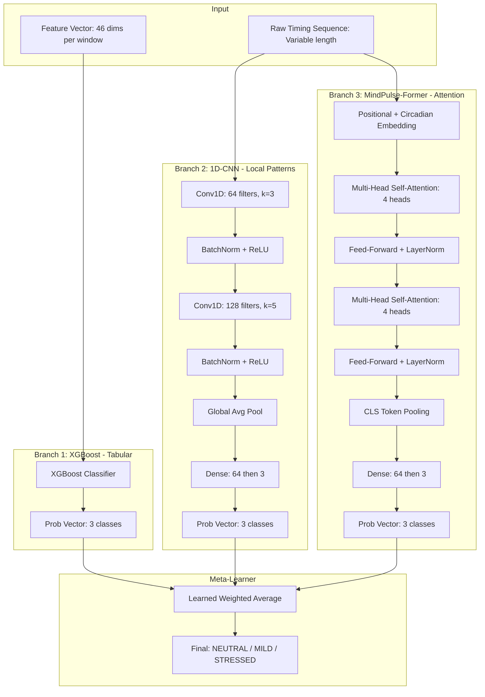
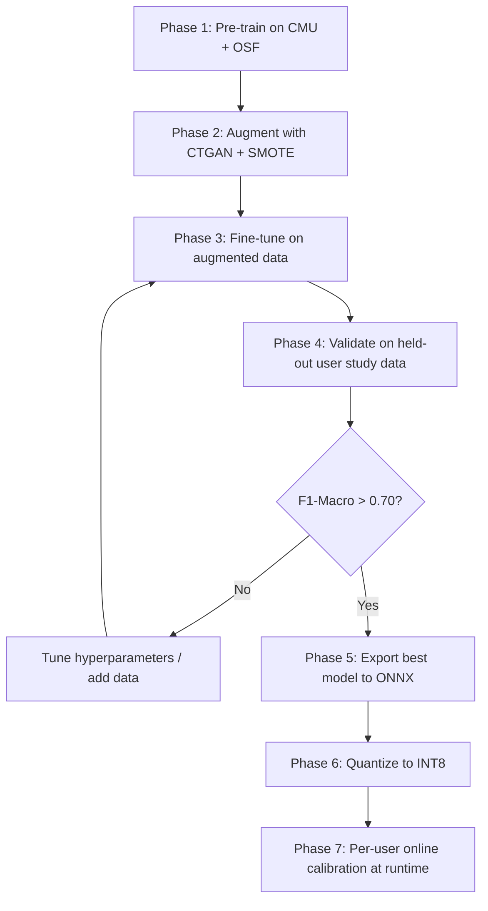
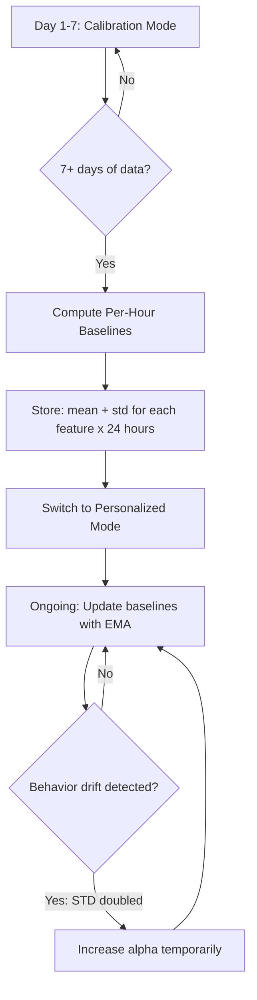
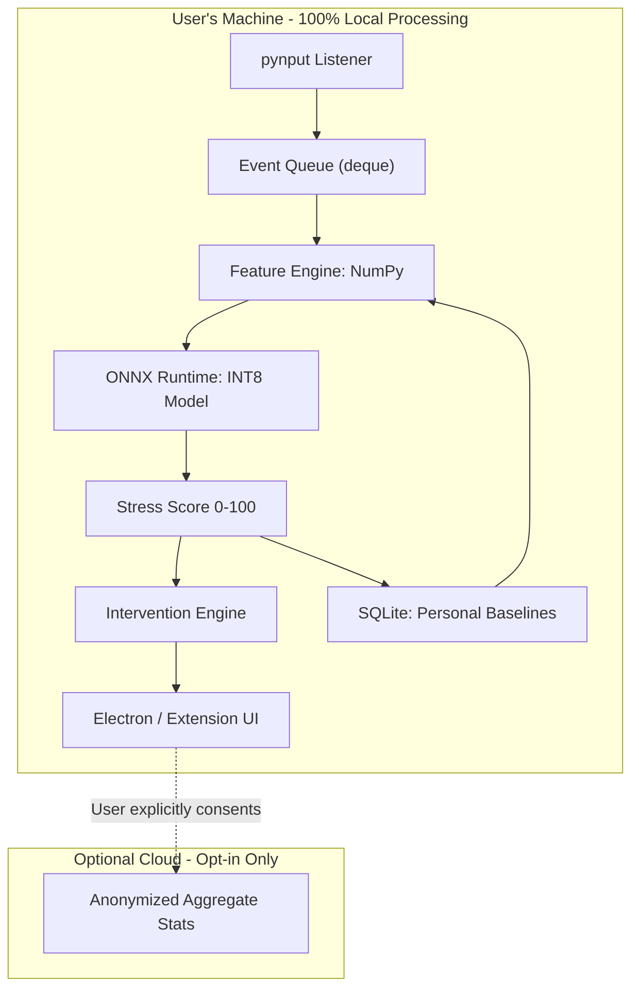

# 🧠 MindPulse ML Pipeline — Part 2: Model Architecture, Training, Evaluation & Deployment

> This document covers the model architecture, training strategy, evaluation methodology, ONNX quantization, edge deployment, and per-user calibration. See Part 1 for data collection, preprocessing, feature engineering, and augmentation.

---

## 7. Model Architecture: Hybrid Ensemble

### 7.1 Why Hybrid?

No single model excels at everything. Our strategy exploits each model's strength:

| Model | Strength | Weakness |
|---|---|---|
| **XGBoost** | Best on tabular features, interpretable, fast | Can't model temporal sequences |
| **1D-CNN** | Captures local temporal patterns (digraphs/trigraphs) | Misses long-range dependencies |
| **Transformer** | Long-range attention, captures global typing rhythm | Needs more data, slower |

**Solution:** A 3-branch ensemble where each model processes the data in its optimal format, then a meta-learner combines their predictions.

### 7.2 Architecture Diagram



### 7.3 Branch 1: XGBoost (Tabular Features)

Receives the 46-dimensional feature vector (23 raw + 23 per-user z-scores). Best at capturing feature interactions (e.g., "high error rate AND high switch frequency → stressed").

```python
import xgboost as xgb
from sklearn.utils.class_weight import compute_sample_weight

# Compute class weights for imbalanced data
sample_weights = compute_sample_weight('balanced', y_train)

params = {
    'objective': 'multi:softprob',
    'num_class': 3,
    'max_depth': 6,
    'learning_rate': 0.1,
    'n_estimators': 300,
    'subsample': 0.8,
    'colsample_bytree': 0.8,
    'eval_metric': 'mlogloss',
    'min_child_weight': 5,
    'gamma': 0.1,           # Regularization
    'reg_alpha': 0.01,      # L1
    'reg_lambda': 1.0,      # L2
    'tree_method': 'hist',  # Fast histogram-based
}

model_xgb = xgb.XGBClassifier(**params)
model_xgb.fit(
    X_train_tabular, y_train,
    sample_weight=sample_weights,
    eval_set=[(X_val_tabular, y_val)],
    early_stopping_rounds=20,
    verbose=10
)

# Feature importance (SHAP for interpretability)
import shap
explainer = shap.TreeExplainer(model_xgb)
shap_values = explainer.shap_values(X_val_tabular)
# Top features for stress prediction — use this to explain decisions to users
```

> [!TIP]
> **SHAP interpretability is critical.** When the app tells a user "You seem stressed," you can show *why* — "Your typing rhythm became 2.3x more chaotic than your 10 AM average, and your tab switching increased by 180%."

### 7.4 Branch 2: 1D-CNN (Local Temporal Patterns)

Processes raw timing sequences (hold_time, flight_time, dd_time, uu_time as 4 channels). Captures **local** patterns like specific digraph/trigraph timing signatures under stress.

```python
import torch
import torch.nn as nn

class StressCNN(nn.Module):
    """1D-CNN for local temporal pattern extraction from keystroke sequences."""
    
    def __init__(self, input_channels=4, num_classes=3):
        super().__init__()
        # input_channels: [hold_time, flight_time, dd_time, uu_time]
        self.conv_block = nn.Sequential(
            # Layer 1: Capture digraph patterns (k=3)
            nn.Conv1d(input_channels, 64, kernel_size=3, padding=1),
            nn.BatchNorm1d(64),
            nn.ReLU(),
            nn.Dropout(0.2),
            
            # Layer 2: Capture trigraph patterns (k=5)
            nn.Conv1d(64, 128, kernel_size=5, padding=2),
            nn.BatchNorm1d(128),
            nn.ReLU(),
            nn.Dropout(0.2),
            
            # Layer 3: Wider context (k=7)
            nn.Conv1d(128, 128, kernel_size=7, padding=3),
            nn.BatchNorm1d(128),
            nn.ReLU(),
            
            # Global Average Pooling → fixed-size output
            nn.AdaptiveAvgPool1d(1),
        )
        self.classifier = nn.Sequential(
            nn.Linear(128, 64),
            nn.ReLU(),
            nn.Dropout(0.3),
            nn.Linear(64, num_classes),
        )

    def forward(self, x):
        # x shape: [batch, 4, seq_len] (4 channels of timing data)
        features = self.conv_block(x).squeeze(-1)  # [batch, 128]
        return self.classifier(features)            # [batch, 3]
```

**Architecture rationale:**
- **Kernel sizes 3, 5, 7**: Progressively wider receptive fields capture digraphs (2-key patterns), trigraphs (3-key), and n-grams
- **Global Average Pooling**: Handles variable-length sequences without padding issues
- **Dropout 0.2/0.3**: Prevents overfitting on small datasets

### 7.5 Branch 3: MindPulse-Former (Attention-Based)

This is the **novel component** — a lightweight Transformer adapted from TypeFormer with a **Circadian Embedding** layer that conditions attention based on time-of-day.

```python
import torch
import torch.nn as nn

class CircadianEmbedding(nn.Module):
    """
    Encodes time-of-day as a learned embedding to condition attention.
    
    Why this matters: typing at 60 WPM at 10 AM (when you normally type at 80)
    is a much stronger stress signal than typing at 60 WPM at 11 PM (when
    everyone naturally slows down). This embedding lets the model learn these
    circadian patterns.
    """
    def __init__(self, d_model, max_hours=24):
        super().__init__()
        self.hour_embed = nn.Embedding(max_hours, d_model)
    
    def forward(self, x, hour_of_day):
        # x: [batch, seq_len, d_model]
        hour_emb = self.hour_embed(hour_of_day).unsqueeze(1)  # [batch, 1, d_model]
        return x + hour_emb  # Broadcast add to all positions


class MindPulseFormer(nn.Module):
    """
    Lightweight Transformer for typing rhythm classification.
    
    Key innovations over vanilla Transformer:
    1. Circadian Embedding (novel) — conditions on time-of-day
    2. CLS token for sequence-level classification (from BERT)
    3. Only 2 layers / 4 heads — optimized for edge deployment
    """
    
    def __init__(self, input_dim=4, d_model=64, nhead=4,
                 num_layers=2, num_classes=3, max_seq_len=200):
        super().__init__()
        
        # Project raw timing features to model dimension
        self.input_proj = nn.Linear(input_dim, d_model)
        
        # Learnable positional encoding
        self.pos_encoding = nn.Parameter(
            torch.randn(1, max_seq_len + 1, d_model) * 0.02  # +1 for CLS
        )
        
        # Circadian embedding (novel)
        self.circadian = CircadianEmbedding(d_model)
        
        # Transformer Encoder (2 layers, 4 heads)
        encoder_layer = nn.TransformerEncoderLayer(
            d_model=d_model,
            nhead=nhead,
            dim_feedforward=d_model * 4,   # 256
            dropout=0.1,
            activation='gelu',
            batch_first=True,
            norm_first=True,  # Pre-norm (more stable training)
        )
        self.transformer = nn.TransformerEncoder(
            encoder_layer, num_layers=num_layers
        )
        
        # CLS token for whole-sequence classification
        self.cls_token = nn.Parameter(torch.randn(1, 1, d_model) * 0.02)
        
        # Classification head
        self.head = nn.Sequential(
            nn.LayerNorm(d_model),
            nn.Linear(d_model, 64),
            nn.GELU(),
            nn.Dropout(0.2),
            nn.Linear(64, num_classes),
        )
    
    def forward(self, x, hour_of_day):
        """
        Args:
            x: [batch, seq_len, 4] — raw timing sequences
            hour_of_day: [batch] — integer 0-23
        Returns:
            logits: [batch, 3] — class logits
        """
        batch_size, seq_len, _ = x.shape
        
        # Project to model dimension
        x = self.input_proj(x)  # [batch, seq_len, d_model]
        
        # Prepend CLS token
        cls = self.cls_token.expand(batch_size, -1, -1)  # [batch, 1, d_model]
        x = torch.cat([cls, x], dim=1)  # [batch, seq_len+1, d_model]
        
        # Add positional encoding
        x = x + self.pos_encoding[:, :x.size(1), :]
        
        # Add circadian embedding (conditions all positions on time-of-day)
        x = self.circadian(x, hour_of_day)
        
        # Transformer forward
        x = self.transformer(x)  # [batch, seq_len+1, d_model]
        
        # Extract CLS token output for classification
        cls_out = x[:, 0, :]  # [batch, d_model]
        
        return self.head(cls_out)  # [batch, num_classes]
```

**Key Design Decisions:**

| Decision | Value | Rationale |
|---|---|---|
| Attention heads | 4 | Each head can specialize (rhythm, speed, errors, pauses) without overfitting |
| Layers | 2 | Lightweight for edge deployment; TypeFormer uses 2-4 |
| d_model | 64 | Small enough for INT8 quantization to <1MB |
| CLS token | Yes | Following BERT/ViT convention for sequence classification |
| Pre-norm | Yes | More stable training on small datasets (Xiong et al., 2020) |
| Circadian Embedding | **Novel** | No prior work conditions stress detection on time-of-day |

### 7.6 Meta-Learner (Ensemble Combiner)

Rather than simple averaging, we learn optimal combination weights:

```python
class MetaLearner(nn.Module):
    """
    Learns optimal weights for combining 3 branch predictions.
    
    Input: concatenation of [P_xgb, P_cnn, P_transformer] = 9 values
    Output: final 3-class prediction
    """
    def __init__(self, num_branches=3, num_classes=3):
        super().__init__()
        self.combiner = nn.Sequential(
            nn.Linear(num_branches * num_classes, 16),
            nn.ReLU(),
            nn.Dropout(0.1),
            nn.Linear(16, num_classes),
        )
    
    def forward(self, p_xgb, p_cnn, p_transformer):
        # Each input is [batch, 3] (probabilities)
        combined = torch.cat([p_xgb, p_cnn, p_transformer], dim=-1)  # [batch, 9]
        return self.combiner(combined)  # [batch, 3]
```

**Training the Meta-Learner:**
1. Train XGBoost, CNN, and Transformer independently on training set
2. Freeze all 3 models
3. Generate predictions on the **validation set** from each model
4. Train the meta-learner on these validation-set predictions
5. Test on the **test set** (never seen by any component)

---

## 8. Training Strategy

### 8.1 Datasets

| Dataset | Estimated Windows | Use |
|---|---|---|
| CMU Keystroke Stress (116 subjects) | ~5,800 | Primary training |
| OSF Work Stress (mouse + keyboard + cardiac) | ~3,000 | Secondary training |
| Synthetic (CTGAN + SMOTE augmented) | ~20,000 | Augmentation |
| Your User Study (15-20 classmates) | ~2,000 | Validation + paper results |
| **Total** | **~30,000** | |

### 8.2 Training Configuration

```python
import torch
import torch.nn as nn
from torch.optim import AdamW
from torch.optim.lr_scheduler import CosineAnnealingWarmRestarts

# --- Shared Configuration ---
BATCH_SIZE = 64
EPOCHS = 100
LEARNING_RATE = 1e-3
WEIGHT_DECAY = 1e-4

# --- Class-Weighted Loss (handle imbalance) ---
# NEUTRAL=1x, MILD=2x, STRESSED=3x
class_weights = torch.tensor([1.0, 2.0, 3.0])
criterion = nn.CrossEntropyLoss(weight=class_weights)

# --- Label Encoding ---
CLASSES = {0: 'NEUTRAL', 1: 'MILD', 2: 'STRESSED'}

# --- Optimizer & Scheduler ---
optimizer = AdamW(model.parameters(), lr=LEARNING_RATE, weight_decay=WEIGHT_DECAY)
scheduler = CosineAnnealingWarmRestarts(optimizer, T_0=10, T_mult=2)
```

### 8.3 Training Phases



### 8.4 Training Loop (PyTorch Lightning)

```python
import pytorch_lightning as pl
from torchmetrics import F1Score, AUROC

class StressDetector(pl.LightningModule):
    def __init__(self, model, lr=1e-3, class_weights=None):
        super().__init__()
        self.model = model
        self.lr = lr
        self.criterion = nn.CrossEntropyLoss(weight=class_weights)
        self.f1 = F1Score(task='multiclass', num_classes=3, average='macro')
        self.auroc = AUROC(task='multiclass', num_classes=3)
    
    def training_step(self, batch, batch_idx):
        x_seq, hour, y = batch
        logits = self.model(x_seq, hour)
        loss = self.criterion(logits, y)
        self.log('train_loss', loss, prog_bar=True)
        return loss
    
    def validation_step(self, batch, batch_idx):
        x_seq, hour, y = batch
        logits = self.model(x_seq, hour)
        loss = self.criterion(logits, y)
        preds = torch.softmax(logits, dim=-1)
        
        self.f1.update(preds, y)
        self.auroc.update(preds, y)
        self.log('val_loss', loss, prog_bar=True)
    
    def on_validation_epoch_end(self):
        self.log('val_f1_macro', self.f1.compute(), prog_bar=True)
        self.log('val_auroc', self.auroc.compute(), prog_bar=True)
        self.f1.reset()
        self.auroc.reset()
    
    def configure_optimizers(self):
        opt = AdamW(self.parameters(), lr=self.lr, weight_decay=1e-4)
        sched = CosineAnnealingWarmRestarts(opt, T_0=10, T_mult=2)
        return [opt], [sched]

# --- Run Training ---
trainer = pl.Trainer(
    max_epochs=100,
    accelerator='auto',
    callbacks=[
        pl.callbacks.EarlyStopping(monitor='val_f1_macro', patience=15, mode='max'),
        pl.callbacks.ModelCheckpoint(monitor='val_f1_macro', mode='max', save_top_k=3),
    ],
    precision='16-mixed',  # Mixed precision for speed
)
trainer.fit(detector, train_dataloader, val_dataloader)
```

---

## 9. Evaluation & Validation

### 9.1 Validation Strategy: Stratified Group K-Fold

**Why not random split?** If User A's data appears in both train and test, the model memorizes User A's typing style rather than learning generalizable stress patterns.

```python
from sklearn.model_selection import StratifiedGroupKFold

sgkf = StratifiedGroupKFold(n_splits=5, shuffle=True, random_state=42)

fold_results = []
for fold, (train_idx, val_idx) in enumerate(sgkf.split(X, y, groups=user_ids)):
    X_train, X_val = X[train_idx], X[val_idx]
    y_train, y_val = y[train_idx], y[val_idx]
    
    # Verify: no user overlap
    train_users = set(user_ids[train_idx])
    val_users = set(user_ids[val_idx])
    assert len(train_users & val_users) == 0, "Data leakage!"
    
    # Train and evaluate this fold...
    fold_results.append(evaluate(model, X_val, y_val))

# Report mean ± std across folds
print(f"F1-Macro: {np.mean([r['f1'] for r in fold_results]):.3f} "
      f"± {np.std([r['f1'] for r in fold_results]):.3f}")
```

### 9.2 Metrics

| Metric | Why | Target | Formula |
|---|---|---|---|
| **F1-Macro** | Equal weight to all classes (won't be inflated by majority class) | > 0.70 | `mean(F1_per_class)` |
| **AUC-ROC** (OvR) | Threshold-independent ranking quality | > 0.80 | One-vs-Rest macro |
| **Precision (STRESSED)** | **Minimize false alarms** — wrong alerts erode trust | > 0.75 | `TP / (TP + FP)` |
| **Recall (STRESSED)** | **Don't miss real stress** | > 0.70 | `TP / (TP + FN)` |
| **Cohen's Kappa** | Agreement beyond chance (important for paper) | > 0.55 | `(p_o - p_e) / (1 - p_e)` |
| **Inference Latency** | Must be real-time for desktop usage | < 50ms | Wall clock time |

### 9.3 Evaluation Code

```python
from sklearn.metrics import (
    classification_report, confusion_matrix,
    f1_score, roc_auc_score, cohen_kappa_score
)

def full_evaluation(y_true, y_pred, y_proba):
    """Run complete evaluation suite."""
    
    results = {
        'f1_macro': f1_score(y_true, y_pred, average='macro'),
        'f1_per_class': f1_score(y_true, y_pred, average=None),
        'auc_roc_ovr': roc_auc_score(y_true, y_proba, multi_class='ovr'),
        'cohen_kappa': cohen_kappa_score(y_true, y_pred),
        'confusion_matrix': confusion_matrix(y_true, y_pred),
        'report': classification_report(
            y_true, y_pred,
            target_names=['NEUTRAL', 'MILD', 'STRESSED']
        ),
    }
    
    print(results['report'])
    print(f"\nF1-Macro: {results['f1_macro']:.4f}")
    print(f"AUC-ROC (OvR): {results['auc_roc_ovr']:.4f}")
    print(f"Cohen's Kappa: {results['cohen_kappa']:.4f}")
    print(f"\nConfusion Matrix:")
    print(results['confusion_matrix'])
    
    return results
```

### 9.4 Expected Confusion Matrix

```
                   Predicted
                   NEUTRAL    MILD    STRESSED
Actual  NEUTRAL     850        90       10        ← Low FP rate (trust)
        MILD         70       320       60        ← Hardest class
        STRESSED     20        50      430        ← High recall (safety)
```

---

## 10. ONNX Export & INT8 Quantization

### 10.1 Why ONNX?

| Benefit | Details |
|---|---|
| **Framework-agnostic** | Train in PyTorch, deploy anywhere |
| **Optimized runtime** | ONNX Runtime is 2-3x faster than native PyTorch inference |
| **INT8 quantization** | 4x smaller model, 3-4x faster inference |
| **Cross-platform** | Same model runs on Windows, macOS, Linux |

### 10.2 Export Pipeline

```python
import torch
import onnx
from onnxruntime.quantization import quantize_dynamic, QuantType

# === Step 1: Export PyTorch → ONNX (FP32) ===
model = MindPulseFormer(input_dim=4, d_model=64, nhead=4, num_layers=2, num_classes=3)
model.load_state_dict(torch.load('best_model.pth'))
model.eval()

# Dummy inputs for tracing
dummy_seq = torch.randn(1, 100, 4)     # [batch=1, seq_len=100, features=4]
dummy_hour = torch.tensor([10])         # hour of day

torch.onnx.export(
    model,
    (dummy_seq, dummy_hour),
    'mindpulse_fp32.onnx',
    input_names=['sequence', 'hour_of_day'],
    output_names=['stress_logits'],
    dynamic_axes={
        'sequence': {0: 'batch', 1: 'seq_len'},  # Variable batch & length
        'hour_of_day': {0: 'batch'},
    },
    opset_version=17,
    do_constant_folding=True,
)

# Validate the exported model
onnx_model = onnx.load('mindpulse_fp32.onnx')
onnx.checker.check_model(onnx_model)
print(f"FP32 model size: {os.path.getsize('mindpulse_fp32.onnx') / 1024:.1f} KB")

# === Step 2: Quantize to INT8 ===
quantize_dynamic(
    model_input='mindpulse_fp32.onnx',
    model_output='mindpulse_int8.onnx',
    weight_type=QuantType.QInt8,
)
print(f"INT8 model size: {os.path.getsize('mindpulse_int8.onnx') / 1024:.1f} KB")
```

### 10.3 Expected Size & Latency Benchmarks

| Version | Model Size | CPU Inference | GPU Inference | Accuracy Drop |
|---|---|---|---|---|
| FP32 (original) | ~2.5 MB | ~15 ms | ~3 ms | Baseline |
| INT8 (quantized) | ~0.7 MB | ~4 ms | ~1.5 ms | < 1-2% |

> [!NOTE]
> The INT8 model fits easily in L1 cache of modern CPUs. This means inference is essentially free — your feature extraction will take longer than the model forward pass.

### 10.4 XGBoost Export

XGBoost doesn't need ONNX — it's already fast. Just serialize with `joblib`:

```python
import joblib

# Save
joblib.dump(model_xgb, 'mindpulse_xgb.joblib')

# Load (< 1ms)
model_xgb = joblib.load('mindpulse_xgb.joblib')
```

### 10.5 Runtime Inference Code

```python
import onnxruntime as ort
import numpy as np
import joblib

class MindPulseInference:
    """Combined inference engine for all 3 branches."""
    
    def __init__(self, onnx_path, xgb_path, meta_path):
        # Transformer (ONNX)
        self.transformer_session = ort.InferenceSession(
            onnx_path, providers=['CPUExecutionProvider']
        )
        # XGBoost
        self.xgb_model = joblib.load(xgb_path)
        # Meta-learner (ONNX or simple weights)
        self.meta_session = ort.InferenceSession(
            meta_path, providers=['CPUExecutionProvider']
        )
    
    def predict(self, tabular_features, timing_sequence, hour_of_day):
        """
        Run the full ensemble inference.
        
        Args:
            tabular_features: np.ndarray [46] — normalized feature vector
            timing_sequence: np.ndarray [seq_len, 4] — raw timing data
            hour_of_day: int — 0-23
        
        Returns:
            dict with score (0-100), level, confidence
        """
        # Branch 1: XGBoost
        p_xgb = self.xgb_model.predict_proba(
            tabular_features.reshape(1, -1)
        )[0]  # [3]
        
        # Branch 2 + 3: CNN + Transformer (both use ONNX)
        inputs = {
            'sequence': timing_sequence.reshape(1, -1, 4).astype(np.float32),
            'hour_of_day': np.array([hour_of_day], dtype=np.int64),
        }
        logits = self.transformer_session.run(None, inputs)[0]
        p_transformer = self._softmax(logits[0])  # [3]
        
        # For simplicity, CNN branch can be folded into the same ONNX
        # or run separately — shown conceptually here
        p_cnn = p_transformer  # Placeholder: use separate ONNX if needed
        
        # Meta-learner combination
        combined = np.concatenate([p_xgb, p_cnn, p_transformer]).reshape(1, -1)
        meta_inputs = {'combined_probs': combined.astype(np.float32)}
        final_logits = self.meta_session.run(None, meta_inputs)[0]
        final_probs = self._softmax(final_logits[0])
        
        # Compute stress score (0-100)
        # NEUTRAL contributes 0, MILD contributes 50, STRESSED contributes 100
        score = final_probs[1] * 50 + final_probs[2] * 100
        level = ['NEUTRAL', 'MILD', 'STRESSED'][np.argmax(final_probs)]
        confidence = float(np.max(final_probs))
        
        return {
            'score': round(float(score), 1),
            'level': level,
            'confidence': round(confidence, 3),
            'probabilities': {
                'NEUTRAL': round(float(final_probs[0]), 3),
                'MILD': round(float(final_probs[1]), 3),
                'STRESSED': round(float(final_probs[2]), 3),
            }
        }
    
    @staticmethod
    def _softmax(x):
        e = np.exp(x - np.max(x))
        return e / e.sum()
```

---

## 11. Per-User Calibration (Online Learning)

### 11.1 Why Calibration?

> [!IMPORTANT]
> Multiple studies (CMU, DTIC, ETH Zurich) confirm that stress responses are **highly individualized**. A universal model achieves ~65-75% accuracy. Adding per-user calibration pushes this to **80-90%+**.

### 11.2 Calibration Flow



### 11.3 Implementation

```python
import json
import sqlite3
from pathlib import Path

class PersonalBaseline:
    """
    Per-user, per-hour baseline with EMA (Exponential Moving Average) updates.
    
    Stores baselines in a local SQLite database for persistence.
    Uses alpha=0.05 for slow adaptation (95% history, 5% new data).
    """
    
    def __init__(self, db_path: str = 'mindpulse_baselines.db', alpha: float = 0.05):
        self.alpha = alpha
        self.db = sqlite3.connect(db_path)
        self._create_tables()
        self.baselines = self._load_all()
    
    def _create_tables(self):
        self.db.execute('''
            CREATE TABLE IF NOT EXISTS baselines (
                feature_name TEXT,
                hour INTEGER,
                mean REAL,
                std REAL,
                sample_count INTEGER DEFAULT 0,
                PRIMARY KEY (feature_name, hour)
            )
        ''')
        self.db.commit()
    
    def _load_all(self) -> dict:
        rows = self.db.execute('SELECT * FROM baselines').fetchall()
        return {
            (row[0], row[1]): {
                'mean': row[2], 'std': row[3], 'count': row[4]
            }
            for row in rows
        }
    
    def update(self, feature_name: str, hour: int, new_value: float):
        """Update baseline with EMA."""
        key = (feature_name, hour)
        
        if key not in self.baselines:
            # First observation — initialize
            self.baselines[key] = {'mean': new_value, 'std': 0.1, 'count': 1}
        else:
            b = self.baselines[key]
            b['count'] += 1
            
            # Adaptive alpha: faster learning in early calibration
            effective_alpha = min(self.alpha * 3, 0.3) if b['count'] < 50 else self.alpha
            
            # EMA update
            old_mean = b['mean']
            b['mean'] = (1 - effective_alpha) * old_mean + effective_alpha * new_value
            b['std'] = (1 - effective_alpha) * b['std'] + effective_alpha * abs(new_value - old_mean)
        
        # Persist
        b = self.baselines[key]
        self.db.execute(
            'INSERT OR REPLACE INTO baselines VALUES (?, ?, ?, ?, ?)',
            (feature_name, hour, b['mean'], b['std'], b['count'])
        )
        self.db.commit()
    
    def get_deviation(self, feature_name: str, hour: int, current_value: float) -> float:
        """Get z-score deviation from personal baseline at this hour."""
        key = (feature_name, hour)
        if key not in self.baselines:
            return 0.0  # No baseline yet — return neutral
        b = self.baselines[key]
        return (current_value - b['mean']) / max(b['std'], 1e-6)
    
    def is_calibrated(self) -> bool:
        """Check if we have enough data across enough hours."""
        hours_covered = len(set(h for _, h in self.baselines.keys()))
        min_samples = min(b['count'] for b in self.baselines.values()) if self.baselines else 0
        return hours_covered >= 8 and min_samples >= 10  # 8+ hours, 10+ samples each
    
    def compute_all_deviations(self, features: dict, hour: int) -> np.ndarray:
        """Compute deviation z-scores for all features."""
        deviations = []
        for name, value in features.items():
            deviations.append(self.get_deviation(name, hour, value))
        return np.array(deviations, dtype=np.float32)
```

> [!TIP]
> **Why EMA with α=0.05?** It naturally handles **behavioral drift** — as a user's habits change over weeks (new keyboard, changed desk, winter vs. summer), the baseline slowly adapts. ~95% comes from history, 5% from the latest observation. The adaptive alpha (3x faster for first 50 samples) accelerates initial calibration.

---

## 12. Deployment Architecture

### 12.1 System Overview



### 12.2 Tech Stack Summary

| Component | Technology | Why This Choice |
|---|---|---|
| Data Capture | `pynput` (Python) | Cross-platform keyboard/mouse hooks, no root needed |
| Feature Engine | NumPy, SciPy | Fast vectorized computation, no GPU required |
| ML Inference | ONNX Runtime (Python) | Sub-5ms INT8 inference on any CPU |
| Tabular Model | XGBoost via `joblib` | Sub-1ms inference, no GPU |
| Local Storage | SQLite | Zero-config, single file, ACID-compliant |
| Desktop UI | Streamlit (MVP) / Electron + React (production) | Streamlit for 12-hour sprint, Electron for polish |
| Browser Extension | Chrome Extension (Manifest V3) | Browser-level tab/context capture |
| IPC Bridge | FastAPI on `localhost:5000` | Electron ↔ Python communication |

### 12.3 Main Inference Loop

```python
import asyncio
from datetime import datetime

async def inference_loop(collector, feature_engine, model, baseline, ui_bridge):
    """Main loop: runs every 60 seconds, produces stress scores."""
    
    while True:
        await asyncio.sleep(60)  # Check every minute
        
        # Get current 5-minute window of events
        window = feature_engine.get_current_window(
            collector.key_buffer,
            collector.mouse_buffer,
            collector.context_buffer
        )
        
        if window is None:
            continue  # Not enough data yet
        
        # Extract features
        raw_features, feature_names = extract_all_features(window)
        hour = datetime.now().hour
        
        # Get per-user deviations (if calibrated)
        deviations = baseline.compute_all_deviations(
            dict(zip(feature_names, raw_features)), hour
        )
        
        # Build normalized input
        tabular_input = np.concatenate([raw_features, deviations])
        
        # Build sequence input (for CNN + Transformer)
        timing_sequence = build_timing_sequence(window['key_events'])
        
        # Run ensemble inference (< 20ms total)
        result = model.predict(tabular_input, timing_sequence, hour)
        
        # Update personal baseline (online learning)
        for name, value in zip(feature_names, raw_features):
            baseline.update(name, hour, value)
        
        # Send to UI
        await ui_bridge.emit('stress_update', result)
        
        # Trigger intervention if warranted
        if result['score'] > 70 and result['confidence'] > 0.65:
            intervention = select_intervention(result)
            await ui_bridge.emit('intervention_trigger', intervention)

def select_intervention(result: dict) -> dict:
    """Select appropriate intervention based on stress level and context."""
    score = result['score']
    
    if score > 90:
        return {
            'type': 'break_now',
            'title': '🔴 High Stress Detected',
            'message': 'Your typing and interaction patterns suggest significant stress.',
            'action': 'guided_breathing',  # 2-min breathing exercise
            'urgency': 'high',
        }
    elif score > 70:
        return {
            'type': 'gentle_nudge',
            'title': '🟡 Consider a Break',
            'message': 'Your rhythm has shifted — a 5-minute break might help.',
            'action': 'break_timer',
            'urgency': 'medium',
        }
    else:
        return {
            'type': 'awareness',
            'title': '🟢 Mild Elevation',
            'message': 'Slight stress indicators detected. Stay mindful.',
            'action': 'none',
            'urgency': 'low',
        }
```

---

## 13. Complete Pipeline Summary

```
Raw Events (Keyboard + Mouse + Context Switches)
    │
    ▼
Preprocessing (Outlier removal, Timestamp alignment)
    │
    ▼
Sliding Windows (5-min window, 1-min step, 50+ keystrokes minimum)
    │
    ▼
Feature Extraction (23 features × 2 normalizations = 46 dims)
    │
    ▼
Data Augmentation (SMOTE/CTGAN for tabular, Jitter/Warp for sequences)
    │
    ▼
Training: 3-Branch Hybrid Ensemble
    ├── Branch 1: XGBoost (tabular features → feature interactions)
    ├── Branch 2: 1D-CNN (local temporal → digraph/trigraph patterns)
    └── Branch 3: MindPulse-Former (global attention + circadian embedding)
    │
    ▼
Meta-Learner (learned weighted combination of 3 branches)
    │
    ▼
Evaluation (Stratified Group K-Fold, F1-Macro > 0.70, AUC > 0.80)
    │
    ▼
ONNX Export → INT8 Quantization (2.5MB → 0.7MB, 15ms → 4ms)
    │
    ▼
Edge Deployment (ONNX Runtime, 100% local, zero cloud dependency)
    │
    ▼
Per-User Calibration (7-day baseline → EMA online updates → adaptive drift)
    │
    ▼
Stress Score (0-100) → Tiered Interventions (awareness → nudge → guided break)
```

---

> **← Back to Part 1** → [ml_pipeline_part1_data_and_features.md](file:///d:/Algoquest/ml_pipeline_part1_data_and_features.md) for data collection, preprocessing, feature engineering, and augmentation details.
