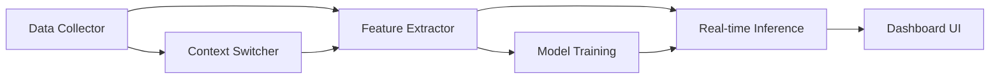

# 🧠 Stress Detection Software — Comprehensive Research Report

## 1. The Tool You're Trying to Recall: Synthetic Data Generators

The website you're thinking of is most likely **[Mockaroo](https://mockaroo.com)**.

> [!TIP]
> **Mockaroo** lets you define a schema (column name + data type), then generates up to 1,000 rows for free in CSV, JSON, SQL, or Excel. It has 200+ built-in data types and ensures interconnected fields (e.g., city matches state). Perfect for bootstrapping a training dataset.

### Other Top-Tier Data Generation Tools

| Tool | Best For | Cost | Format |
|---|---|---|---|
| **[Mockaroo](https://mockaroo.com)** | General realistic tabular data, 200+ types | Free (1K rows), paid plans | CSV, JSON, SQL, XML, Excel |
| **[Generatedata.com](https://generatedata.com)** | Open-source, 30+ types, interconnected data | Free & open-source | CSV, SQL, JSON, XML |
| **[SDV (Synthetic Data Vault)](https://sdv.dev)** | Generating synthetic data that **preserves statistical properties** of real data | Free, open-source Python lib | Any (via Python) |
| **[CTGAN / TGAN](https://github.com/sdv-dev/CTGAN)** | GAN-based generation of highly realistic tabular data | Free, open-source | Any (via Python) |
| **[Gretel.ai](https://gretel.ai)** | API-driven synthetic data with privacy guarantees | Freemium | API, CSV |
| **[Mostly AI](https://mostly.ai)** | Privacy-first, enterprise-grade synthetic data | Freemium | Various |
| **[Argilla Synthetic Data Generator](https://huggingface.co/spaces/argilla/synthetic-data-generator)** | LLM-powered dataset generation for NLP fine-tuning | Free on HuggingFace | JSON, CSV |
| **[Synthea](https://synthetichealth.github.io/synthea/)** | Synthetic **patient / healthcare** data | Free, open-source | FHIR, CSV |

> [!IMPORTANT]
> For your stress detection use case, I recommend a **hybrid approach**: use **Mockaroo** for initial schema prototyping, then use **SDV/CTGAN** to amplify real samples while preserving statistical distributions. This gives you the best of both worlds — speed and statistical validity.

---

## 2. Existing Research & State of the Art

### 2.1 The ETH Zurich Breakthrough (2023, ongoing)

The most cited work in this space comes from **ETH Zurich**, which found that **typing and mouse behavior are MORE accurate predictors of stress than heart rate** in office environments. Key findings:

- **Stressed typists** make more errors, exhibit a "fits and starts" pattern (frequent, *brief* pauses)
- **Relaxed typists** take *fewer but longer* pauses
- **Stressed mouse users** move the pointer more frequently, less precisely, over longer distances
- **Relaxed mouse users** take shorter, more direct paths

This is explained by **neuromotor noise theory** — elevated stress impairs the brain's information processing, degrading fine motor control.

### 2.2 VTT Finland AI Tool (2024)

VTT Technical Research Centre developed an AI tool detecting stress in knowledge workers with **71% accuracy** from mouse movements alone. Accuracy improves when combined with typing tempo data.

### 2.3 Real-World Field Study (2025-2026)

A study published in early 2026 achieved:
- **76% accuracy** differentiating 3 stress levels from **keyboard data alone**
- **63% accuracy** from **mouse data alone**
- Collected in real-world work settings (not just labs)

### 2.4 Key Insight: Stress is Highly Individualized

> [!WARNING]
> Multiple studies (CMU, DTIC) confirm that stress responses in typing data are **highly individualized**. A universal "one-size-fits-all" model performs poorly. **You MUST build per-user baseline profiles** for accurate detection. This is actually your biggest novelty opportunity (see Section 4).

---

## 3. Publicly Available Datasets

| Dataset | Source | What It Contains | Link |
|---|---|---|---|
| **CMU Keystroke Stress Dataset** | Carnegie Mellon University | Keystroke timings (hold/latency) from 116 subjects in neutral + stressed states, plus demographic/psychological/physiological data | [CMU InfSci](https://www.cmu.edu) |
| **OSF Work Stress Dataset** | Open Science Framework | Mouse, keyboard, and cardiac data from in-field work stress study | [osf.io/qpekf](https://osf.io/qpekf/) |
| **Multimodal Stress Dataset** | Zenodo | Keystroke + facial expression + physio signals from 30 participants under different stress levels | [Zenodo](https://zenodo.org) |
| **KeyRecs** | Zenodo | Fixed-text & free-text samples from 100 participants, inter-key latencies | [Zenodo](https://zenodo.org) |
| **IKDD** | MDPI | Free-text keystroke dynamics from 164 volunteers | [MDPI](https://mdpi.com) |
| **Mendeley Keystroke Data** | Mendeley Data | Integrated data from 3 public keystroke datasets (human-written + synthesized) | [Mendeley](https://data.mendeley.com) |

---

## 4. Novel Features & Innovations (Your Competitive Edge)

This is where it gets exciting. Here are features **borrowed from adjacent domains** that are underutilized in stress detection, plus novel ideas:

### 4.1 🔥 Rage Clicks & Dead Clicks (from UX Analytics)

**Origin:** UX tools like Hotjar, FullStory, and Contentsquare detect "rage clicks" (rapid repeated clicking on unresponsive elements) and "dead clicks" (clicking non-interactive areas).

**Your Innovation:** Redefine these as **stress biomarkers**, not just usability bugs:
- **Rage clicks** → measure as a proxy for **frustration intensity**
- **Dead clicks** → correlate with **cognitive overload / confusion**
- **Thrashed cursor** (erratic, circular mouse movement) → map to **anxiety / indecision**

Instead of flagging UX bugs, you're flagging **mental state changes**. Nobody does this.

### 4.2 🧭 Scroll Depth & Scroll Velocity Patterns (from UX Analytics)

**Origin:** UX tools measure how far users scroll and where they stop.

**Your Innovation:**
- **Rapid doom-scrolling** patterns (fast scroll, no engagement) → correlate with **dissociative behavior** / procrastination under stress
- **Scroll velocity variance** → sudden speed changes indicate attention fragmentation
- **Content abandonment depth** → users stopping earlier than usual on familiar content indicates reduced focus

### 4.3 ⏱️ Hesitation Mapping (from UX Session Replay)

**Origin:** FullStory tracks hover duration before clicks.

**Your Innovation:**
- Pre-click **hover time increasing** over a session → indicates **decision fatigue**
- **Cursor-to-click delay** increasing → cognitive processing slowing down
- Build a **hesitation index** that correlates with self-reported stress surveys

### 4.4 🔄 Context-Switch Frequency Analysis (from Productivity Tools)

**Origin:** RescueTime and DeskTrack track app switching.

**Your Innovation (this is gold):**
- Measure **tab/app switching frequency** per minute → map to **cognitive load**
- Calculate **entropy of task switching** (how random vs. structured the switching is)
- Differentiate between:
  - **Productive multitasking** (low entropy, structured switching between related apps)
  - **Stress-driven scatter** (high entropy, random switching, no completion)
- Track **time-to-return** (how long before a user returns to a task they abandoned) → longer = more avoidance behavior

### 4.5 🌙 Circadian Rhythm Deviation Detection (from Chronobiology)

**Origin:** Circadian rhythm science shows motor performance varies by time of day.

**Your Innovation:**
- Build each user's **personal circadian typing profile** (their natural speed/accuracy curve across the day)
- Detect **deviations from their own baseline at specific hours** → this is far more sensitive than absolute thresholds
- Example: A user who normally types at 80 WPM at 10 AM but drops to 55 WPM at 10 AM → strong stress signal, even though 55 WPM is "normal" for the average person
- No existing stress detection tool does per-user circadian-adjusted baselines

### 4.6 📊 Digital Phenotyping Score (from Mobile Health Research)

**Origin:** Academic concept from smartphone passive sensing for mental health.

**Your Innovation:** Create a composite **"Digital Stress Phenotype"** score that combines:
- Typing rhythm entropy
- Mouse movement precision decline
- Context-switch chaos score
- Circadian deviation magnitude  
- Rage/frustration click density
- Hesitation index growth rate

This single composite score (0-100) makes the output **actionable** for non-technical users.

### 4.7 🎯 Micro-Break Detection & Absence Patterns (from Workforce Analytics)

**Origin:** Tools like Veriato and Teramind track idle periods.

**Your Innovation:**
- Differentiate between:
  - **Healthy micro-breaks** (regular, 2-5 min, after sustained focus → actually reduces stress)
  - **Freeze responses** (sudden unexplained stops → possible acute stress moment)
  - **Avoidance absences** (increasingly longer breaks with shortened work bursts → chronic stress/burnout)
- No stress tool differentiates break *quality* like this

### 4.8 🧬 Typing Rhythm Entropy (Novel Signal)

**Not borrowed, this is new:**
- Measure the **Shannon entropy** of inter-key intervals within typing sessions
- Low entropy = rhythmic, consistent typing → relaxed state
- High entropy = chaotic, unpredictable timing → stress
- This is computationally cheap and extremely privacy-preserving (you only need timing data)

### 4.9 🖱️ Mouse Gesture Vocabulary (from Gesture Recognition)

**Origin:** Gesture recognition in mobile/tablet interfaces.

**Your Innovation:**
- Define a vocabulary of **mouse micro-gestures**: circles, zigzags, hover-and-retreat, rapid back-and-forth
- Each gesture maps to a psychological state (hesitation, frustration, boredom)
- Train a lightweight **gesture classifier** alongside your main stress model

---

## 5. Privacy-Preserving Architecture

This is critical to your project's value proposition:

### 5.1 Content-Agnostic Design

```
❌ DO NOT capture: actual keystrokes, screen content, page URLs, text typed
✅ DO capture: timing metadata, movement patterns, event counters
```

### 5.2 Data Pipeline

```
┌─────────────────────────────────────────────────────────┐
│                    LOCAL DEVICE ONLY                      │
│                                                          │
│  Raw Events → Feature Extraction → Discard Raw Data      │
│       ↓                                                  │
│  Features (timing, counts, trajectories)                 │
│       ↓                                                  │
│  ML Inference (local model)                              │
│       ↓                                                  │
│  Stress Score + Confidence → Dashboard                   │
│                                                          │
│  ⚠️ Raw keystrokes NEVER stored or transmitted           │
└─────────────────────────────────────────────────────────┘
```

### 5.3 Key Privacy Techniques
- **Key label obfuscation:** Replace all alphanumeric key labels with random symbols before feature extraction
- **Temporal bucketing:** Aggregate timing data into 5-minute windows, never store individual keystrokes
- **No content logging:** Only record *when* keys are pressed, not *which* keys
- **Local-only processing:** All ML inference runs on-device
- **Opt-in transparency:** Show users exactly what data is captured (a live dashboard of features)

---

## 6. Feature Engineering — The Complete Feature Set

### 6.1 Keyboard Features
| Feature | Description | Signal |
|---|---|---|
| `key_hold_time_mean` | Average time a key is pressed | ↑ under stress |
| `key_hold_time_std` | Variation in hold times | ↑ under stress |
| `flight_time_mean` | Avg time between key release & next press | Variable |
| `flight_time_std` | Variation in flight times | ↑ under stress |
| `typing_speed_wpm` | Words per minute | ↓ under stress |
| `error_rate` | Backspace frequency / total keystrokes | ↑ under stress |
| `pause_frequency` | Number of pauses > 2s per minute | ↑ under stress (short pauses) |
| `pause_duration_mean` | Average pause length | ↓ under stress (many short vs few long) |
| `typing_burst_length` | Avg keystrokes between pauses | ↓ under stress |
| `rhythm_entropy` | Shannon entropy of inter-key intervals | ↑ under stress |

### 6.2 Mouse Features
| Feature | Description | Signal |
|---|---|---|
| `mouse_speed_mean` | Average pointer velocity | ↑ under stress |
| `mouse_speed_std` | Velocity variation | ↑ under stress |
| `path_straightness` | Straight-line / actual distance ratio | ↓ under stress |
| `click_precision` | Distance from target center at click | ↓ under stress |
| `rage_click_count` | Clusters of 3+ clicks within 2s | ↑ under stress |
| `dead_click_count` | Clicks on non-interactive elements | ↑ under stress |
| `hover_time_mean` | Average hover before click | ↑ under stress |
| `scroll_velocity_std` | Scroll speed variation | ↑ under stress |
| `cursor_direction_changes` | Frequency of direction reversal | ↑ under stress |

### 6.3 Context / App-Switching Features
| Feature | Description | Signal |
|---|---|---|
| `tab_switch_freq` | Tab switches per minute | ↑ under stress |
| `app_switch_freq` | Application switches per minute | ↑ under stress |
| `switch_entropy` | Randomness of switching pattern | ↑ under stress |
| `time_to_return` | Avg time to return to abandoned task | ↑ under stress |
| `session_fragmentation` | Ratio of micro-sessions to total time | ↑ under stress |

### 6.4 Temporal / Circadian Features
| Feature | Description | Signal |
|---|---|---|
| `hour_of_day` | Current hour | Context |
| `day_of_week` | Current day | Context |
| `deviation_from_baseline` | Feature deviation from personal norm at this hour | ↑ = stress |
| `session_duration` | Time actively working | Context (burnout signal) |
| `idle_pattern_type` | Classification of break patterns | Quality signal |

---

## 7. ML Model Strategy

### 7.1 Recommended Models

| Model | Why | Accuracy Expectation |
|---|---|---|
| **XGBoost** | Best for tabular features, handles feature interactions well | 70-80% |
| **Random Forest** | Robust, interpretable, good baseline | 65-75% |
| **1D-CNN on time series** | Captures temporal patterns in keystroke sequences | 72-82% |
| **LSTM / GRU** | Sequence modeling for typing rhythm | 70-80% |
| **Per-User Fine-Tuned Model** | Transfer learning from general model → fine-tune on individual | 80-90%+ |

### 7.2 Training Strategy

```
Phase 1: Pre-train on public datasets (CMU, OSF)
    ↓
Phase 2: Augment with Mockaroo + CTGAN synthetic data
    ↓
Phase 3: Calibration period (7-14 days) per user to learn their baseline
    ↓
Phase 4: Per-user model fine-tuning with online learning
```

> [!IMPORTANT]
> The **calibration period** is your secret weapon. By learning what's "normal" for each individual user, you eliminate the biggest weakness of prior work (individualized stress responses). This is a publishable novelty.

---

## 8. The 12-Hour Execution Plan

### Hour-by-Hour Breakdown

| Hour | Task | Deliverable |
|---|---|---|
| **0-1** | Project setup: Python env, Electron scaffold, folder structure | Working skeleton app |
| **1-2** | Build the **Data Collection Layer**: `pynput` keyboard/mouse listener, event queue | Raw event capture working |
| **2-3** | Build the **Feature Extraction Engine**: all features from Section 6 | Feature vectors computed in real-time |
| **3-4** | Download + preprocess **CMU + OSF datasets** | Clean, normalized training data |
| **4-5** | Generate **synthetic training data** with Mockaroo + CTGAN to augment | 10x more training samples |
| **5-6** | Train **XGBoost + Random Forest** models, evaluate with cross-validation | Model files (.pkl / .joblib) |
| **6-7** | Integrate model into Python backend with real-time inference pipeline | Live stress scoring working |
| **7-8** | Build the **Electron dashboard**: stress score visualization, trend chart, current state indicator | MVP UI |
| **8-9** | Implement **per-user calibration** system (baseline learning + deviation detection) | Personalized detection working |
| **9-10** | Add **context-switch tracking** (tab/app switching via OS APIs) | Full feature set |
| **10-11** | Polish: add break recommendations, daily summary, export/reporting | Feature-complete |
| **11-12** | Testing, bug fixing, documentation, README, demo recording | Deliverable product |

### Critical Path Dependencies



### 12-Hour Shortcuts (What to Sacrifice)

> [!CAUTION]
> To truly one-shot this in 12 hours, you must make strategic sacrifices:

1. **Skip Electron** → Use a **Streamlit** dashboard instead (saves ~2 hours of frontend work)
2. **Skip per-user fine-tuning** → Use a general model with z-score deviation from a 30-minute calibration window
3. **Skip app-level context switching** → Focus on keyboard + mouse first (tab switching requires OS-specific APIs that take time to debug)
4. **Use pre-trained models from literature** → If you find weights from the CMU study, use them as-is

### Recommended Tech Stack for 12-Hour Sprint

```
Backend:      Python 3.10+
Data Capture: pynput (keyboard + mouse)
Features:     NumPy, Pandas, SciPy
ML:           scikit-learn (XGBoost, RF), joblib
Dashboard:    Streamlit (fastest to prototype)
Data Gen:     Mockaroo API + SDV/CTGAN
Packaging:    PyInstaller (if you need a .exe)
```

---

## 9. Summary of Novelty Claims

Here's what makes your project **genuinely novel** and potentially publishable:

1. **Multi-modal behavioral fusion:** Combining keyboard + mouse + context-switching (most papers use 1-2)
2. **UX analytics → stress biomarkers:** Rage clicks, dead clicks, hesitation index (nobody does this)
3. **Circadian-adjusted per-user baselines:** The gold standard that papers call for but don't implement
4. **Typing rhythm entropy:** Computationally cheap, privacy-preserving, strong signal
5. **Break quality classification:** Differentiating healthy vs. freeze vs. avoidance breaks
6. **Context-switch entropy:** Measuring randomness of task switching as a cognitive load proxy
7. **Composite Digital Stress Phenotype score:** A single actionable metric from all modalities

---

## 10. Papers to Read

1. **Veigas & Nörtemann (2023)** — ETH Zurich: "Mouse and Keyboard Usage Can Reveal Stress Levels" — The foundational paper
2. **CMU Keystroke Stress Study** — Baseline dataset and methodology
3. **VTT Finland (2024)** — AI stress detection from mouse pointer at 71% accuracy
4. **Medrxiv 2025 Preprint** — Mouse, keyboard, and HRV combined model
5. **BiAffect Project** — Smartphone keystroke dynamics as digital biomarkers for mood disorders
